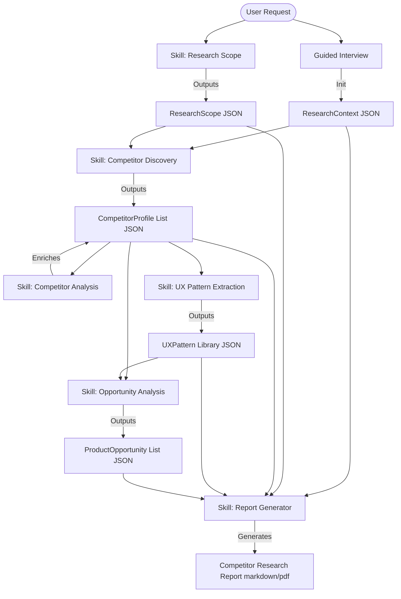

# Architectural Specification & Shared Data Models

This document specifies the system architecture, data flow, and shared data models for the Competitor Analysis agent.

---

## 🛠️ Data Flow Architecture

The workflow executes as a pipe-and-filter pipeline where each modular **Skill** takes standard JSON structures, performs its dedicated analysis (using external MCP servers), and outputs/extends standard JSON structures.



To maintain modularity and state persistence between runs, intermediate outputs are saved in `.gemini/antigravity-ide/scratch/` or local JSON state files.

---

## 📋 Shared Data Models (JSON Schemas)

### 1. `ResearchContext`
Describes the research parameters, target audience, specific questions, and scope.

```json
{
  "id": "string (UUID)",
  "projectName": "string",
  "goals": ["string"],
  "targetAudience": "string",
  "focusAreas": ["string"],
  "platforms": ["Web" | "iOS" | "Android"],
  "marketSegment": "string",
  "timestamp": "string (ISO 8601)"
}
```

**Example:**
```json
{
  "id": "ctx-9823-11a",
  "projectName": "Mobile NeoBank Launch",
  "goals": ["Understand onboarding speed", "Identify biometric auth patterns"],
  "targetAudience": "Tech-savvy Gen-Z users in Europe",
  "focusAreas": ["Onboarding", "KYC Identity Verification"],
  "platforms": ["iOS", "Android"],
  "marketSegment": "Fintech / NeoBanking",
  "timestamp": "2026-07-13T12:00:00Z"
}
```

---

### 1.5. `ResearchScope`
Configures the specific UI components, interaction categories, and custom guidelines for the audit.

```json
{
  "selectedCategories": ["string"],
  "customInstructions": {
    "categoryName": "string"
  },
  "deepInspect": {
    "categoryName": "boolean"
  }
}
```

**Example:**
```json
{
  "selectedCategories": ["Onboarding", "Forms", "Pricing"],
  "customInstructions": {
    "Onboarding": "Analyze the number of fields in the signup form and check if social login is available.",
    "Pricing": "Examine monthly vs annual billing toggles."
  },
  "deepInspect": {
    "Onboarding": true,
    "Forms": false,
    "Pricing": true
  }
}
```

---

### 2. `CompetitorProfile`
Captures detailed qualitative and quantitative information about each competitor.

```json
{
  "id": "string",
  "name": "string",
  "website": "string (URL)",
  "category": "Direct" | "Indirect" | "Best-in-class" | "Emerging",
  "marketShare": "string (e.g. Leader, Challenger, Niche)",
  "pricingModels": [
    {
      "tierName": "string",
      "price": "string",
      "features": ["string"]
    }
  ],
  "keyFeatures": ["string"],
  "strengths": ["string"],
  "weaknesses": ["string"],
  "positioningStatement": "string",
  "screenshots": {
    "landingPage": "string",
    "pricingPage": "string"
  },
  "navigationAnalysis": "string",
  "informationArchitecture": ["string"],
  "featureInventory": [
    {
      "featureName": "string",
      "status": "Supported" | "Partial" | "Unsupported",
      "notes": "string"
    }
  ],
  "observations": ["string"]
}
```

**Example:**
```json
{
  "id": "comp-revolut",
  "name": "Revolut",
  "website": "https://revolut.com",
  "category": "Direct",
  "marketShare": "Leader",
  "pricingModels": [
    {
      "tierName": "Standard",
      "price": "€0/mo",
      "features": ["Free UK IBAN", "No fee currency exchange up to €1000"]
    },
    {
      "tierName": "Premium",
      "price": "€8.99/mo",
      "features": ["Global insurance", "Higher ATM limits", "Custom designs"]
    }
  ],
  "keyFeatures": ["Multi-currency accounts", "Crypto buying", "Savings Vaults"],
  "strengths": ["Rapid account setup", "Vast cross-border capabilities"],
  "weaknesses": ["Complex fee structures for weekend exchange", "Slower customer support on free tiers"],
  "positioningStatement": "The global financial super-app for managing all your spending, savings, and investments.",
  "screenshots": {
    "landingPage": "assets/screenshots/competitor-revolut-landing.png",
    "pricingPage": "assets/screenshots/competitor-revolut-pricing.png"
  },
  "navigationAnalysis": "Sticky top bar navigation menu with dynamic dashboard submenus.",
  "informationArchitecture": ["/pricing", "/business", "/cards", "/help"],
  "featureInventory": [
    {
      "featureName": "Onboarding",
      "status": "Supported",
      "notes": "Fast verification flows, collects phone number and runs SMS pin check."
    },
    {
      "featureName": "Pricing",
      "status": "Supported",
      "notes": "Shows monthly vs annual discount toggles prominently."
    }
  ],
  "observations": [
    "Sign-up CTA is sticky and remains in view while scrolling page."
  ]
}
```

---

### 3. `UXPattern`
Represents an interaction pattern or user flow extracted from a competitor's application, containing visual evidence and interaction details.

```json
{
  "id": "string",
  "competitorId": "string",
  "flowName": "string (e.g. Signup Flow)",
  "steps": [
    {
      "stepNumber": "integer",
      "title": "string",
      "description": "string",
      "screenshotPath": "string (relative path to file)",
      "elementSelectors": ["string"]
    }
  ],
  "patternPros": ["string"],
  "patternCons": ["string"],
  "bestPracticesIdentified": ["string"],
  "designSystemParity": {
    "fontStylesMatched": "boolean",
    "colorTokensMatched": "boolean",
    "notes": "string"
  }
}
```

**Example:**
```json
{
  "id": "pattern-rev-signup",
  "competitorId": "comp-revolut",
  "flowName": "Signup Flow",
  "steps": [
    {
      "stepNumber": 1,
      "title": "Phone Number Input",
      "description": "Clean landing screen requesting phone number with automatic country code selection.",
      "screenshotPath": "assets/screenshots/competitor-revolut-signup-1.png",
      "elementSelectors": ["input[type='tel']", "button[data-testid='submit']"]
    },
    {
      "stepNumber": 2,
      "title": "SMS Passcode Verification",
      "description": "Auto-focus code input. Clear option to resend SMS after 60 seconds.",
      "screenshotPath": "assets/screenshots/competitor-revolut-signup-2.png",
      "elementSelectors": ["input[maxlength='6']"]
    }
  ],
  "patternPros": ["Extremely high autofocus reliability", "Clear resend timer prevents spamming"],
  "patternCons": ["Requires manual keyboard input, no automatic SMS fill supported on mobile web"],
  "bestPracticesIdentified": ["Limit code entries to a single row of split inputs to reduce error rates"],
  "designSystemParity": {
    "fontStylesMatched": false,
    "colorTokensMatched": true,
    "notes": "Uses custom typeface matching branding; primary CTA color aligns with web button tokens."
  }
}
```

---

### 4. `ProductOpportunity`
Identifies opportunities based on gaps discovered between competitors' offerings and target user needs.

```json
{
  "id": "string",
  "title": "string",
  "description": "string",
  "gapAddressed": "string",
  "competitorsImpacted": ["string (competitor names)"],
  "opportunityType": "Feature Gap" | "UX Improvement" | "Pricing Strategy" | "Technology Advantage",
  "impact": "High" | "Medium" | "Low",
  "effort": "High" | "Medium" | "Low",
  "actionPlan": ["string"]
}
```

**Example:**
```json
{
  "id": "opp-biometric-kyc",
  "title": "Biometric Face-ID Integration in Web KYC",
  "description": "Most competitors redirect mobile web users to download the app to finish KYC. We can offer a native WebAuthn / Camera KYC in-browser.",
  "gapAddressed": "High signup abandonment rates due to forced app installations during KYC verification.",
  "competitorsImpacted": ["Revolut", "Monzo"],
  "opportunityType": "UX Improvement",
  "impact": "High",
  "effort": "Medium",
  "actionPlan": [
    "Integrate inline WebRTC-based camera stream for document verification.",
    "Implement WebAuthn for browser-based secure key storage."
  ]
}
```

---

### 5. `ResearchReport`
The structured schema representing the complete research output.

```json
{
  "context": "ResearchContext",
  "competitors": ["CompetitorProfile"],
  "uxPatterns": ["UXPattern"],
  "opportunities": ["ProductOpportunity"],
  "generatedAt": "string (ISO 8601)",
  "author": "string"
}
```
