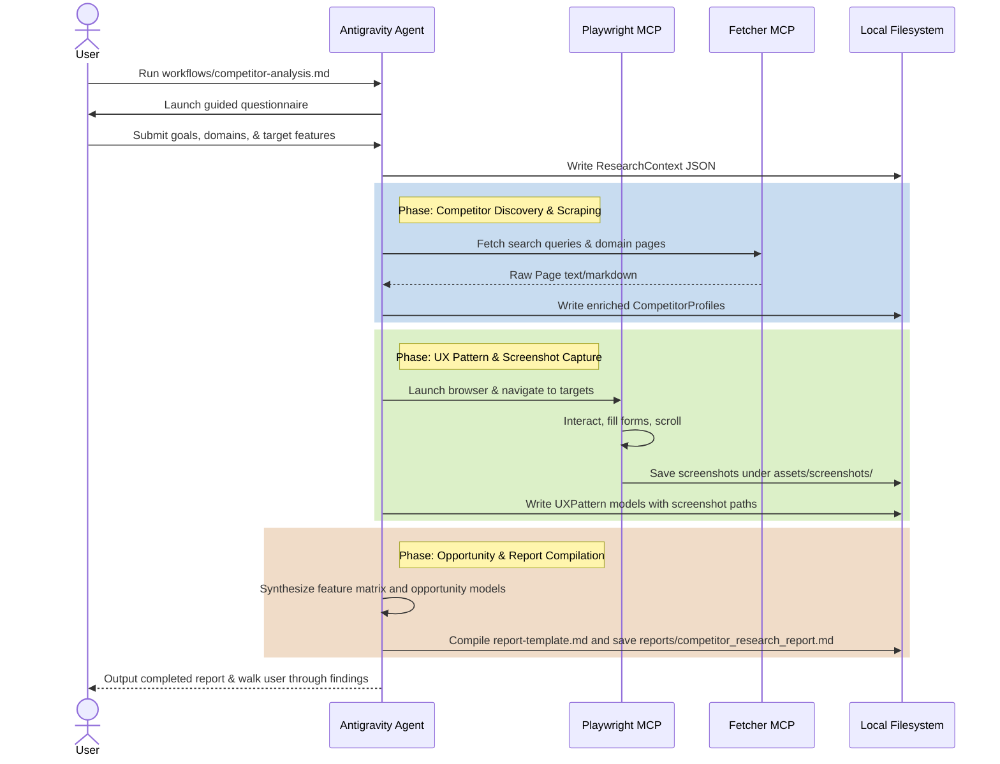

# Workflow Execution Guide

This document describes how the Competitor Analysis workflow operates and details the interaction model between the user and the agent.

---

## 🛠️ Execution Process

The workflow runs in a series of guided steps, orchestrating several analysis skills.

---

## 🙋 Guided Questionnaire (Initialization)

When you run `workflows/competitor-analysis.md`, the agent prompts you with the following questions:

1. **What is the name of your project or product?** (e.g., *SaaS Subscriptions Tracker*)
2. **What are the primary goals of this research?** (e.g., *Analyze how competitors manage subscription renewals*)
3. **Who is the target audience?** (e.g., *SMB operations managers*)
4. **Who are the competitors to investigate?** (Provide specific URLs, or specify "Discover automatically")
5. **Which user flows or features should we focus on?** (e.g., *Signup flow, renewal alerts, notification settings*)
6. **Should we run Playwright browser scraping live or inspect static Figma designs?** (Options: *Live browser scraping*, *Figma files*, or *Both*)

Once answered, the agent initializes the JSON data schemas and begins executing the active skills sequentially.
